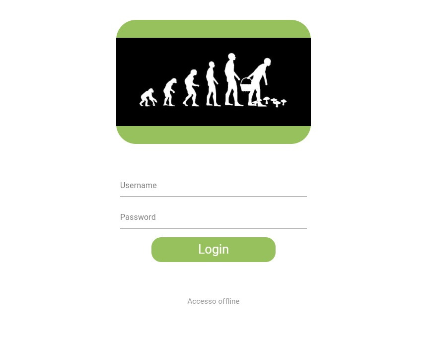
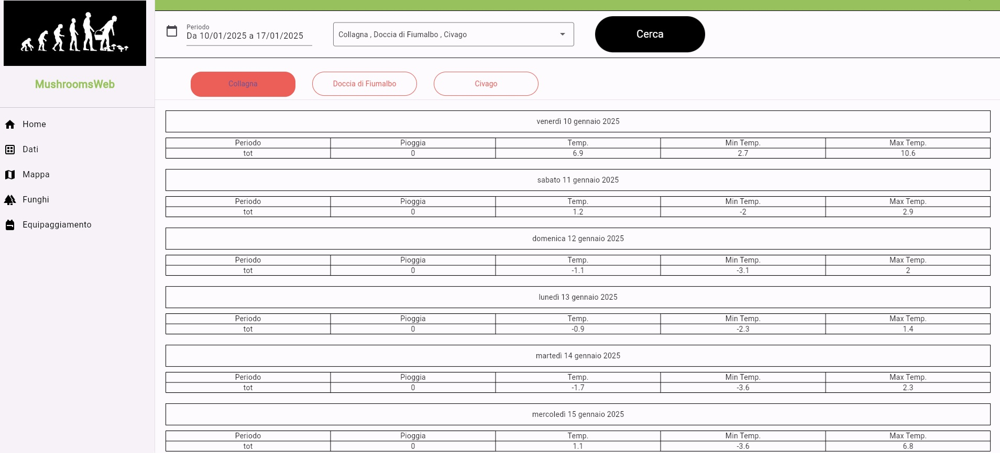
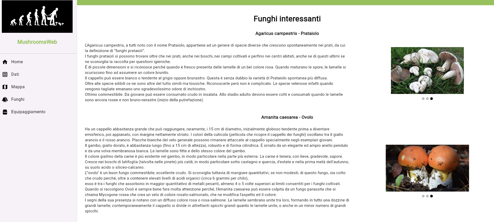
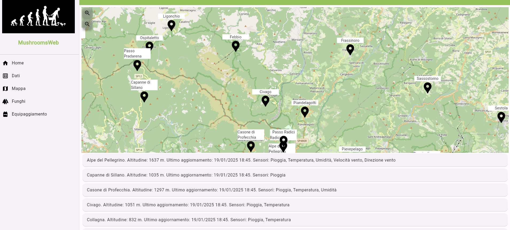

# Appennino Weather Insights for Mushroom Enthusiasts 🌦️🍄

This project serves as a comprehensive guide, created in September 2023, for collecting and analyzing weather data from stations across the Appennino in Reggio Emilia and Modena. It provides tools for data acquisition, storage, and visualization, with a particular focus on identifying optimal meteorological conditions for mushroom hunting.

---

## 🚀 Features

- **Weather Data Collection**: Retrieve temperature, wind, pressure, and other data from multiple weather stations.
- **Database Integration**: Store collected data in a relational database for efficient querying and analysis.
- **Web Application**: Visualize weather data and explore detailed information about mushrooms.
- **Mushroom Hunting Insights**: Analyze weather patterns to identify optimal conditions for mushroom growth.
- **Educational Mushroom Guide**: Learn about various mushroom species found in the Appennino region.

---

## 📂 Repository Structure

```
|-- Client/
    |-- costants.py                 
    |-- database.py             # Python interface for interacting with a MariaDB database, specifically designed for managing weather station data
    |-- diagnostic.py           # Logger module
    |-- fileExplorer.py         # Exporting weather station data to an Excel file
    |-- main.py                 # It provides a comprehensive implementation for collecting, processing, and storing meteorological data from Emilia Romagna and Toscana regions
    |-- requirements.txt        # It specifies the required python modules
    |-- available_data.txt      # Available weather stations and weather parameters
|-- Server/
    |-- server.ts               # TypeScript module implementing a server-side API for managing a meteorological data dashboard
    |-- database.ts             # TypeScript module implementing a MariaDB handler to facilitate server-side database management for a meteorological dashboard
    |-- package-lock.json
    |-- tsconfig.json
|-- LICENSE
|-- README.md
```

---

## 📷 Screenshots

Below are some previews of the web dashboard:

1. **Login Page**  
   

2. **Weather Data Viewer**  
   

3. **Map of the Weather Stations**  
   

4. **Educational Mushroom Guide**  
   

---

## Repository Disclaimer

This repository serves as a **template** and starting point for building a weather tracking and mushroom hunting insights system. While it includes the main structure and code components, it is **not fully operational out of the box**. Users will need to:

- Configure the database (e.g., add credentials).
- Set up API keys for weather data providers.
- Set up a Flutter project for the web dashboard.
- Customize mushroom-related content and visualizations for their specific needs.

This repository is intended as a **guide** to help users build their own customized solution. Contributions and extensions are welcome!

---

## 📜 License

This project is licensed under the MIT License. See the [LICENSE](LICENSE) file for details.

---

## 🤝 Contributions

Contributions are welcome! Feel free to fork this repository, submit issues, or create pull requests.

---

Enjoy tracking the weather and happy mushroom hunting! 🌦️🍄
